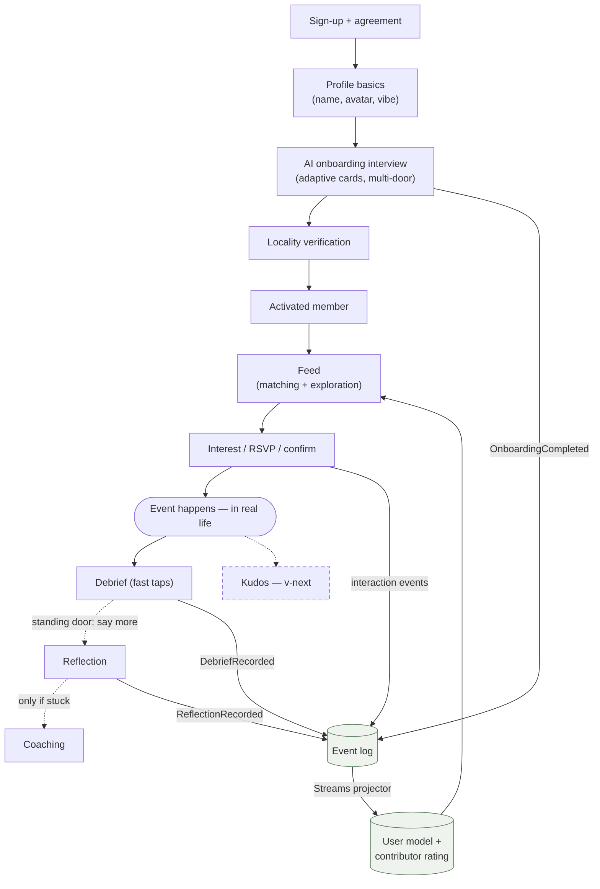
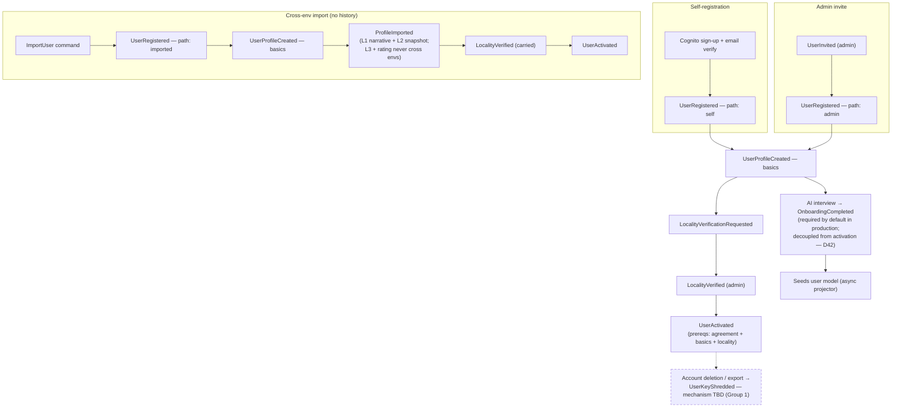
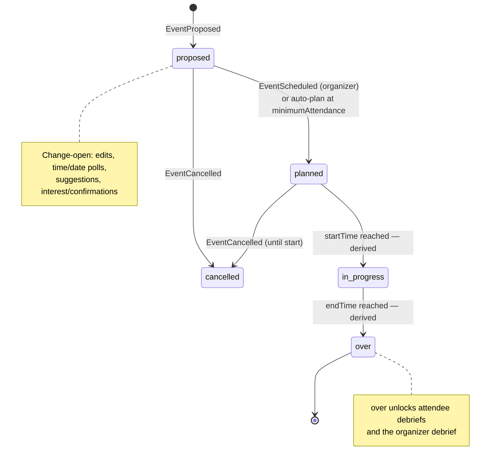
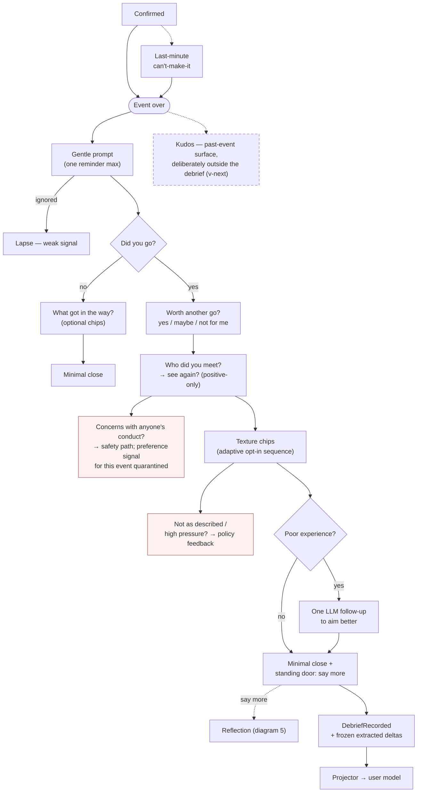
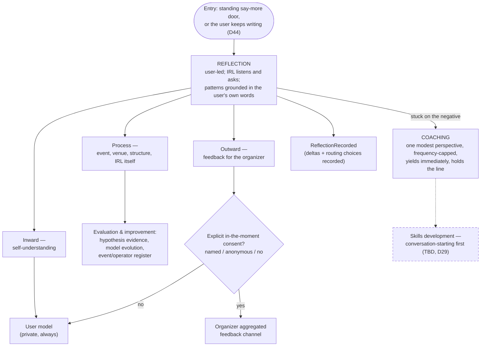
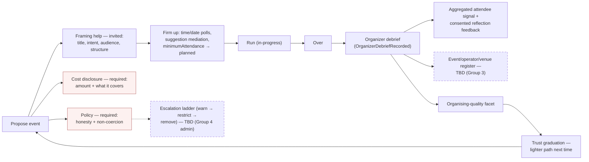
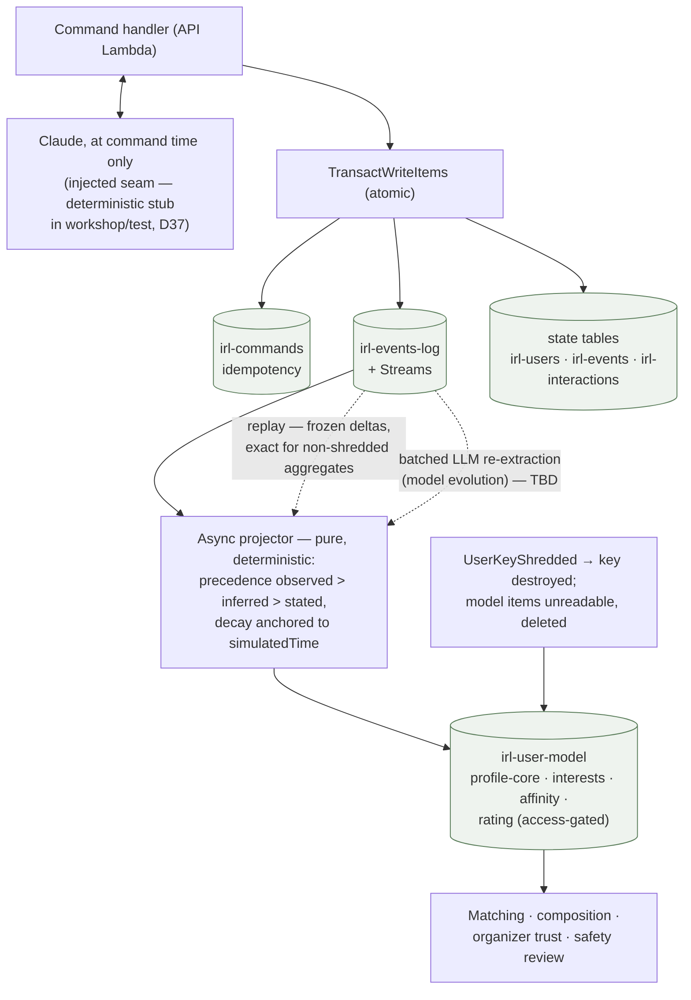

# IRL — Process & Flow Diagrams

The visual companion to the design notes. Each diagram cites the note that owns it; the notes remain the source of truth — if a diagram and a note disagree, the note wins and the diagram is a bug.

**Legend:** solid = designed (a note covers it) · **dashed = TBD or deferred** (recognised, not yet designed) · red-tinted = required gate / safety path · green cylinder = data store.

---

## 1. The big picture — member journey and the signal loop

The spine of the whole product: understanding is *seeded* at onboarding and *grown* from lived signal; everything the member does feeds the model that shapes what they see next. (`README.md`, `user-model.md`, `success-and-progress.md`)

---

## 2. Member lifecycle — three registration paths

All paths converge on the same events; only path metadata differs. The interview is required by default in production but **structurally decoupled from activation** (D42) — activation prerequisites are agreement + basics + locality. (`event-sourcing.md` → Registration & user lifecycle)

---

## 3. Event lifecycle

Stored states are command-driven; **in-progress and over are time-derived** from the simulated clock, never stored (`lifecycle-state.mjs`). Change surfaces (edits, suggestions, polls, interest) are open only while proposed/planned. (`event-sourcing.md`, Group 2 code on `main`)

**TBD around the event lifecycle** (recognised, not yet designed): recurring events (Group 7) · richer cancellation flow — what happens to RSVPs and how attendees are notified (Group 2) · interest-before-commitment surfacing (Group 2) · richer event data — images, descriptions, co-organisers (Group 2) · in-progress interaction between confirm and debrief (Group 2) · the real time/place picker behind "suggest change" (Group 2).

---

## 4. Attendee experience — debrief with its three doors

Fast path is taps only (zero LLM calls); depth is one call, and only after a poor experience. Safety and policy are separate calm doors, never mixed into preference signal. (`debrief.md`)

---

## 5. Reflection & coaching — modes and routing

The debrief is information; these are the deeper, opt-in modes it opens a door to. Reflection is dual-scope (D43); nothing leaves it toward another member without explicit consent. (`reflection-and-coaching.md`)

---

## 6. Organizer journey

Two engagement modes kept distinct: **invited** (collaborative, most of it) and **required** (gates). Trust-graduated — support and scrutiny scale down with track record. (`organizer-engagement.md`, `event-policy.md`)

---

## 7. Data & projection architecture

One write path; the LLM acts only at command time (frozen deltas ride in events); the projector is pure and replayable. (`event-sourcing.md`, `projection-store.md`, `workshop-mode.md`)

---

## 8. Matching pipeline

Fit-first, bounded soft nudges, a preserved exploration/injection floor; nothing gates except hard constraints and explicit earned thresholds. The loop closes through success indicators and hypothesis-driven tuning. (`matching.md`, `success-and-progress.md`, `hypotheses.md`)

```mermaid
flowchart LR
    CAND["Candidate events<br/>and rooms"] --> HC["HARD CONSTRAINTS — filter:<br/>schedule, distance, blocks, capacity"]
    HC --> FIT["FIT — base score, dominant:<br/>comfort envelope + doors + interests<br/>(works cold, from onboarding)"]
    FIT --> NUD["+ capped nudges:<br/>affinity, crews, welcomer signal"]
    NUD --> DW["− soft de-weights:<br/>avoidance, didn't-click<br/>(never hard-remove)"]
    DW --> EXP["Blend: exploration floor +<br/>newcomer injection into<br/>well-fitting rooms"]
    EXP --> OUT["Feed / suggestions /<br/>group composition"]
    OUT --> RES["Real-world outcomes:<br/>attend, return, see-again, crews"]
    RES --> IND["Success indicators —<br/>never targets (D39)"]
    IND --> TUNE["Hypothesis-driven tuning (D41):<br/>named tunables, kill criteria"]
    TUNE -.-> NUD
    TUNE -.-> EXP
```

---

## TBD inventory (dashed elements, in one place)

| Element | Where it appears | Status |
|---|---|---|
| Kudos (structured encouragement) | 1, 4 | Designed in shape (D45), scheduled v-next |
| Skills development (conversation-starting first) | 5 | First-class capability, own note pending (D29) |
| Batched LLM re-extraction (model evolution) | 7 | Named, uncosted (`projection-store.md`) |
| Event/operator/venue register | 6 | Group 3 |
| Escalation ladder / admin & support UI | 6 | Group 4 |
| Account deletion / export mechanism + key management | 2 | Group 1 — key management **blocks onboarding** (open-risks #3) |
| Recurring events, cancellation flow, interest surfacing, richer event data, suggest-change picker | 3 | Group 2 / 7 |
| Crew detection & continuity events | (matching) | Group 3; continuity deferred (D33) |
| Robot users / automated workshop activity | (workshop) | Deferred until needed (D2/D37) |
| Billing gates · automated locality · minors | — | Groups 5 / 1 / 6 |
